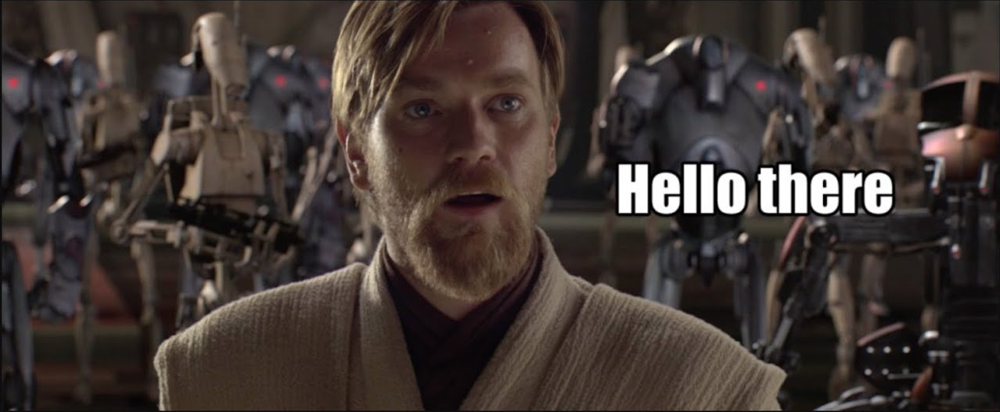
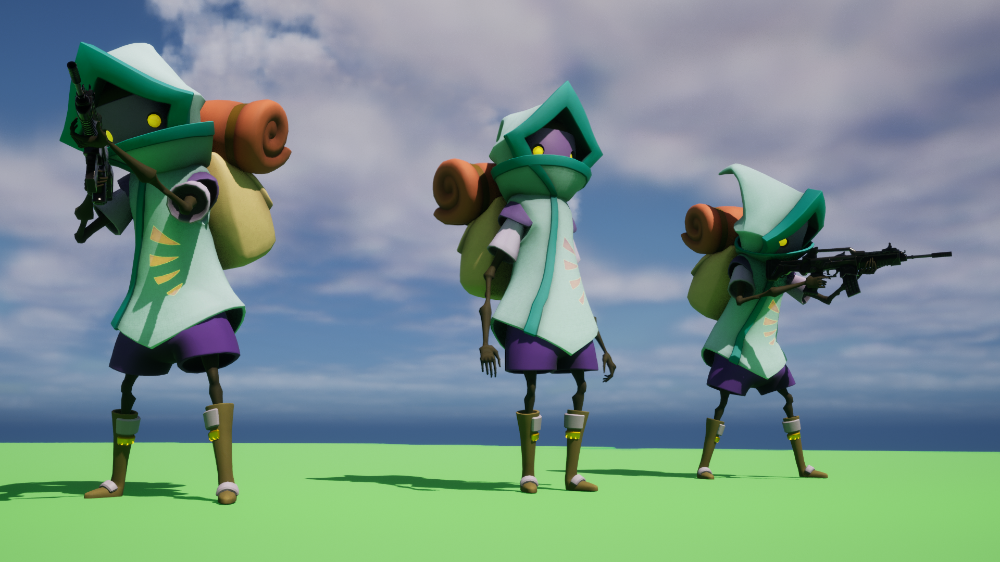
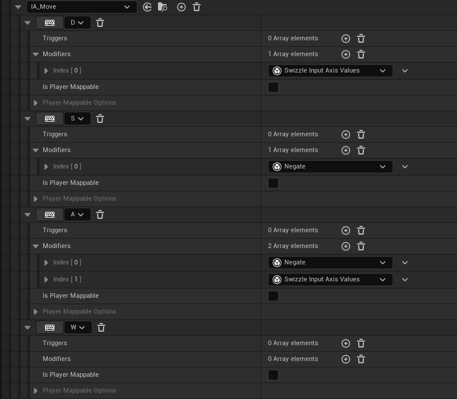
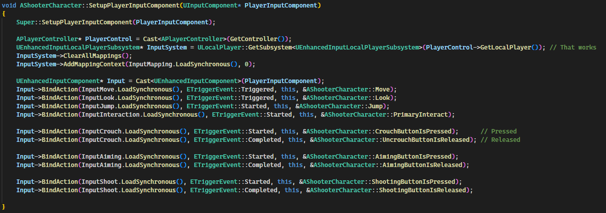
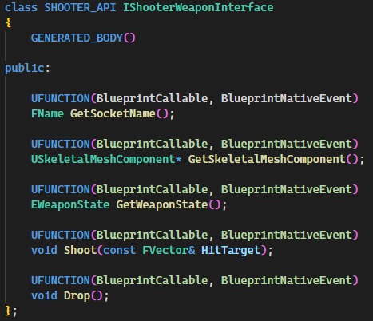
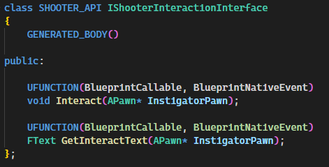

# Shooter Project

> **This project is part of my study of Game Development.**
> 
> **Engine Version: 5.1.**
> 

# Project Features (Mix C++ and Blueprint)
- **Third-person Character Movement** (Using Enhanced Input System)
  - `Input Actions`
  - `Mapping Context Setting Up`
- **Animation Instance**
  - `Setting up Animation`
  - `Retargeting Animation`
  - `FABRIK` 
  - `Weapon Montage Animation`
- **Attribute Component** (Contains Player Health etc.)
- **Weapon System**
  - `Weapon Component` (Interaction between the weapon and the player)
  - `Weapon Interface` (Contains the necessary functionality for weapons)
  - Weapon Base Class
  - Projectile Base Class
- **Interaction System**
  - `Interaction Component` (Interaction between the other object and the player)
  - `Interaction Interface` (Contains the necessary functionality for interactable object)
- **Multiplayer Support** for all features 
  - `Online Subsystem Plugin` (For Steam Connections)
  - Main menu to host/join game
  - Using Replicated Properties and RPCs
- **UI Elements**
  - Health bar
  - Projected Widgets for interactable objects

> **This project is part of my study of Game Development.**
# Enhanced Input System

This project uses the new "Enhanced Input System" input system.
The Enhanced Input Plugin provides developers with an upgrade path and
backward compatibility from the default input system from Unreal Engine 4 (UE4)

This is an example of setting up an input Move action in the Mapping Context

And this is my Player Input Component

> **This project is part of my study of Game Development.**
# Used Interfaces

Weapon Interface

Interaction Interface

> **This project is part of my study of Game Development.**

# Video

